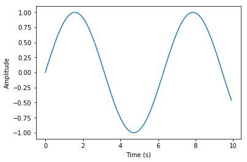
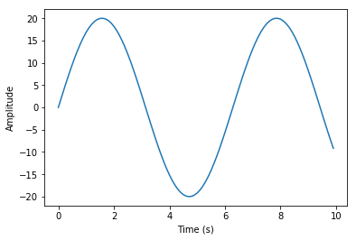

# This blog post was written in a Jupyter Notebook
> And then converted to markdown... and then converted to html using Jeckyl.

- toc: false 
- badges: true
- comments: true
- image: images/copied_from_nb/my_icons/wave.png
- categories: [jupyter, blogging, visualisation]

> Why should I care?

I think it's kind of cool that you can write text beside snippets of code that _actually run_ and automatically have the output of your code display alongside it.

## A quick example:

Say I want to describe a function that plots a sine wave at different amplitudes.

### First, I would define the function


```python
import matplotlib.pyplot as plt
import numpy as np

def plot_sin(amplitude=1):
    '''Plot a sine wave of a given amplitude'''
    time = np.arange(0, 10, 0.1)
    y = np.sin(time)
    plt.plot(time, amplitude*y)
    plt.ylabel('Amplitude')
    plt.xlabel('Time (s)')
    plt.show()
```

Then, just after defining it, I could call it with different arguments and display the outputs alongside any text.

### Sine wave with the default amplitude of 1


```python
plot_sin()
```





### Sine wave with an amplitude of 20


```python
plot_sin(amplitude=20)
```





All of the above was written and ran within a Jupyter Notebook and automatically formatted for this blogpost.
I didn't have to have some scripts lying around to create the images in the post. 
I didn't have to save, upload and link to the images.
I didn't have to worry that the code examples wouldn't run.

You can also paste images as you would expect.


## How is that possible?

It's a mix and match of a few different tools. 

Namely:
- Jupyter Notebooks
- fast-template
- Github Pages
- Jekyll
- nbdev

#### Jupyter Notebooks

I'm imagining most people reading this will know what [Jupyter](https://jupyter.org/) Notebooks are. From their website: 

> The Jupyter Notebook is an open-source web application that allows you to create and share documents that contain live code, equations, visualizations and narrative text.

#### fast-template

The repo was first created from the [fast-template](https://www.fast.ai/2020/01/16/fast_template/) repo from [fast.ai](www.fast.ai)'s Jeremy Howard. This is a simplified way to generate a blog and host it using [Github Pages](https://pages.github.com/). You can write your posts in [Markdown Language](https://help.github.com/en/github/writing-on-github/basic-writing-and-formatting-syntax) and when you commit them to your repo, they will be converted to html for your blog using [Jekyll](https://jekyllrb.com/).

#### nbdev

[nbdev](https://www.fast.ai/2019/12/02/nbdev/) is a really powerful library which isn't being used to it's fullest potential here. It's a tool to create entire python libraries, a website hosting your documentation and way to automatically run tests... all using Jupyter Notebooks. 

But for this project, it's being used to export output cells and any uploaded attachment from Jupyter Notebooks to markdown using `nbdev_detach *.ipynb` and `nbdev_nb2md` to convert notebooks to markdown. It's also being used to remove metadata from the notebooks during git commits, which helps reducing the change of merge conflicts. That last feature is probably overkill because I don't think I'll be doing a lot of merging.

#### Github Actions

Last but not least, Github Actions runs all of the above during each commit automatically! See [here](https://github.com/scottire/scottire.github.io/blob/master/.github/workflows/main.yml) for the config. This is mostly taken from nbdev with a few things changed.

## Thanks for reading

If you'd like, you can find this blogs github repo [here](https://github.com/scottire/scottire.github.io) or follow me on Twitter [here](https://www.twitter.com/_scottcondron)

A huge thanks to Jeremy Howard at fastai for making fast-template and nbdev which is doing all of the hard work to bring all these tools together!
